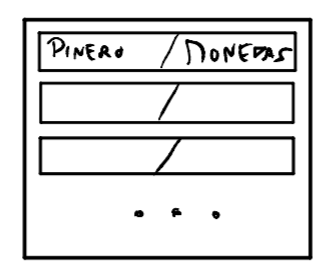

# Java is Creep

Somos una empresa dedicada al desarrollo de videojuegos con un potencial de diversion explosivo.

[Trello](https://trello.com/b/mT8An0gk/java-is-creep)
___
## Roles de los integrantes
- Game Designer: Axel
- Artist: Leo
- Programmers:
    - Servidor: Dani – Sergio
    - Phaser: Axel – Fonti – Sergio
-	Music: Axel – Fonti
-	CM: Axel – Fonti
-   Técnico: Fonti

___

## Descripción Workflow en Git

La metodología que hemos seguido para nuestro proyecto es [Gitflow Workflow](https://www.atlassian.com/git/tutorials/comparing-workflows/gitflow-workflow) diseñada por Atlassian.

Tenemos una rama principal **master** en la cual únicamente publicamos versiones estables y numeradas.

La rama de desarrollo general se denomina **develop** en ella se publican versiones de las cuales se puede llegar a realizar un release a **master**. Desde esta rama nacen ramas individuales para cada desarrollador denominadas **features** y que reciben un nombre descriptivo de la funcionalidad que desarrollan.

Estas **features** a su vez pueden actuar como un segundo develop para una porción del equipo de desarrollo si fuera necesario. Por ejemplo la rama _desarrolloJuegoBuena_ es un develop secundario de la que nacen features en relación al servidor o al cliente, evitando así posibles conflictos en el merge. 

En principio los commits de las **features** también deben ser descriptivos de lo que han desarrollado, si no se llega a la meta intentada en el commit se debe aplicar la etiqueta *WIP* al comienzo del mismo si es posible.

Los **features** se cierran en **develop** y aunque se pueden reutilizar, es mejor práctica crear una rama nueva continuando la numeración del feature que se está desarrollando. Si un **feature** no va a continuar y por lo cual no se cerrará con **develop** se debe realizar un commit de *DISCONTINUED* para dar por terminada a la rama.
___

## Descripción del juego básica
Carrera de caracoles, basadas en diferentes habilidades y stats (en función del personaje), con obstáculos y power ups. Nuestro personaje tiene una barra de estamina que se va gastando en función de cuanto tiempo acelere. 

El fin del juego es, o ganar la carrera esquivando los obstáculos, haciendo buen uso de los recursos (como son la estamina y los power ups), o sobrevivir el máximo tiempo posible con las vidas disponibles.

___

## Interacción Persona - Máquina
1. Avance automático a una velocidad base propia de cara personaje. Recupera estamina a esa velocidad siempre y cuando no se encuentre en ningún obstáculo.
2. Toques repetidos para acelerar. Gasta estamina para ir más deprisa.
3. Mantener pulsado para power up.

Con este tipo de interacción, no se puede frenar, siempre se está avanzando, lo que hace que los obstáculos sean mucho más difíciles de esquivar y prever. 

Si se pierde la estamina, se tiene que esperar hasta recuperarla entera, y volverá a avanzar.

## Representación Visual del Juego
Lateral: diseños sin profundidad. Los personajes se superponen (lo cual obliga a que vayas en el primer carril siempre y que todas las trampas y power-ups estén en el mismo lugar para todos)

___
## Personajes + Habilidades
-	Caracol marino: Soltar baba en todos los carriles, disminuyendo la velocidad en ese tramo.

-	Gatocol: Un mini salto, permite no caer en trampillas, saltar para alcanzar antes el final de un tramo de pared, etc.

-	Caracol Normal: Convertirse en rueda (sin moverse) y ser inmune durante unos segundos. Puede servirte para no perder vida/estamina por culpa de un fuego, puerta, objeto enemigo, etc. 

-   SnailDona: Su habilidad le permite subir paredes más rápido

-	Caracol Francés: Lanza tinta a todos sus rivales, de tal forma que dejan de ver la pantalla menos un círculo a su alrededor durante unos instantes.

-	Caracol Tanque: Puede hacer un temblor a 1 personaje aleatorio, si este está en una pared, se cae.

-	Caracol ladrón: Roba la estamina (o el objeto) de otro caracol sólo si le toca (y tiene el power up exclusivo).

-	Caracol Arcoiris: Le toca un objeto aleatorio aunque vaya en primera posición

## Obstáculos
-	Paredes: estructuras de las que el caracol puede caer si se queda sin estamina. Mientras se sube por estas estructuras, se pierde estamina aun en velocidad base.
-	Puertas: servirían para aplastar al personaje y quitar vida, para obligar a que tenga que subir una pared y coger otro camino o esperar a que se vuelva a abrir, etc.
    - Por ejemplo, una puerta vertical justo en mitad de una pared, puede obligarte a subir la pared o bajar y esperar a que se abra para entrar (diseño de niveles)
-	Trampilla: similar a la puerta, pero en el suelo, puede hacerte caer y tener que tomar otro camino que debería ser más lento.
-	Ventilador/Aspirador (o algo similar): puede empujarte tanto para bien como para mal.
    - Por ejemplo, en el tema cocina, si hubiera un extractor o algo similar, podría hacerte subir más rápido una pared.
-	Fuego/Pinchos: te quita la estamina completa.
-	Cuestas (tanto hacia abajo como hacia arriba): varían la velocidad del caracol en ese tramo.
-	Hielo: mantienes a la velocidad a la que hayas entrado a la zona de hielo hasta que salgas de ella
-	Trampolines: te hacen saltar.
    - Por ejemplo, en el mapa de cocina esto podría ser una sartén que se agitara cada X tiempo y te hiciera subir a otra zona más rápida.

## Power Ups
-	Velocidad: el caracol rueda por el mapa, recupera la estamina (solo disponible cuando no hay paredes)
-	Escudo (endurecimiento de concha): evita un golpe que te quite la estamina
-	Boost estamina: hace que no se gaste durante un periodo de tiempo
-	Tinta: le quita la visión parcialmente a los demás jugadores durante un periodo de tiempo
-	Gancho: te permite engancharte a otro jugador, ir a su misma velocidad y no perder estamina durante un periodo de tiempo
-	Reloj: te hace para el tiempo de las cosas, permitiendo así aprovechar puertas, por ejemplo (para todo el mundo)
-	Veneno: reduce la estamina o la regeneración de esta a los enemigos durante X tiempo.
-	Peso pesado: se lo mandas al enemigo más cercano por delante de ti y le disminuyes la velocidad máxima (SLOOOW)
-	Peso Ligero: funciona sobre uno mismo, similar al de la velocidad pero para las paredes.

*** Si hay un objeto que no quiero usar, cuando encuentres otro objeto, se superpone y se pierde

## Escenarios
-	Escenario jardín de una casa, con obstáculos como:
    - Paredes = piedras, vallas, macetas
    - Trampillas = hormigueros
    - Trampolines = hojas
    - Pincho = Topo (Reseteado)
-	Escenario de cocina:
    - Paredes = muebles
    - Trampillas = fregadero o cajones
    - Fuego = hornillo
    - Puertas
    - Ventilador = extractor, ventiladores normales
    - Trampolines = sartén
-	Escenario de Hielo:
    - Hielo
    - Paredes = piedra
    - Trampillas = hielo roto o agua
    - Objetos que te aplastan = estalactitas

___

## Modos de juego
-	Solo: Juegas contra tu propia marca de tiempo, con vidas. Los mapas para este tipo de modo de juego siempre son los mismos.
-	Maratón: Consiste en aguantar el máximo de tiempo sin perder las vidas.
-	Multijugador Local: contra otro jugador, con pantalla dividida:

        En PC, permite hasta 4 jugadores dividiendo la pantalla en cruz
        En móvil, permite 2 jugadores, dividiendo la pantalla a mitad y con los jugadores enfrentados

- Multijugador Online: contra jugadores de internet. Se pueden acceder a salas tanto privadas como públicas, permitiendo así conectar a amigos.

___

## Interfaces
### Pantalla Inicio
- Simple pantalla con un dibujo que se pase a la siguiente solo con tocar la pantalla

### Inicio de Sesión
-	Cuadro de texto para escribir usuario y contraseña
-	Botón de iniciar (aceptar los datos)
-	Botón de crear cuenta nueva
-	Botón de olvidé la contraseña (para esto, habría que tener datos de contacto como el correo al crear cuenta) ¿?
-	Pop up si hay algún error en usuario o contraseña

 

### Crear cuenta
-	Cuadro de texto para escribir usuario y contraseña (¿y confirmar contraseña?)
-	Cuadro de texto para el correo ¿?
-	Botón de crear cuenta
-	Pop up si ya está creada esa cuenta o si el Nick no está disponible
 
 

### Menú
-	Modos de juego (Solo, Aguante y multijugador online y local)
-	Botón Desconectar
-	Botón Opciones
-	Botón Amigos (en el caso de que se tome esta opción en el modo de multijugador)
-	Botones de RRSS
-	Indicador de monedas
-	Botón de Trofeos y Logros
 

 

### Opciones (desplegable)
-	Cambiar Idioma
-	Quitar/poner sonido
-	Opción para daltónicos
-	Quitar/poner pantalla completa en PC
-	Donación y contacto

 

### Juego
-	Barra de progreso del porcentaje del nivel que lleves
-	Objeto que tengas equipado en un momento dado
-	Botón que permita salir de la partida (ventana pop up)

 
 
### Salir desde pantalla juego
-	Botón de confirmación o atrás

### Tienda
-	Desplazamiento de ofertas diarias / sugerencias
-	Botón para añadir monedas al juego
-	Selección de un personaje (te lleva tanto al personaje como a sus skins posibles para comprar). Aquí podríamos ver de qué personajes disponemos, así como las skins.
 
 

### Añadir monedas (pop up)
-	Diferentes precios en función de la cantidad de monedas (falta por decidir la cuantía de estas mismas)

 
 
### Personaje de la tienda
-	Personaje básico en el centro de la pantalla + descripción de su habilidad especial.
-	Botón para comprar personaje
-	Skins en un desplazable en un lateral (vertical u horizontal)

 
 
### Confirmación de compra
-	Botón tanto de aceptar como de denegar la compra, con un antes y después en las monedas del juego
### Fin de partida
-	Posición en la que quedas + monedas ganadas + clasificación (provisional y que se vaya actualizando, para esto puede ser útil la barra de progreso que hay que mostrar durante la carrera). Posibilidad de ver a otro jugador (¿?)
-	Botón de volver a jugar (en función del poseedor de la sala, falta por concretar):
o	Se vuelve a la sala de espera. Si se sale el creador de la sala, esta sala pasa a ser de otro jugador y queda +1 hueco libre. Si se sale todo el mundo, se cierra la sala
-	Botón de salir

 

### Menú Modo de Juego Solo / Modo Multijugador Local
-	Elegir ambientación (Pradera, Cocina o Hielo inicialmente, son 3 botones) + botón random
-	Aparecen botones para los distintos mapas disponibles, con el tiempo anterior conseguido

 

### Menú Modo Maratón
-	Elegir ambientación + tiempos conseguidos en cada uno

 

### Menú Modo Multijugador Online
-	Selector de Ambientación (similar a los anteriores) + botón random
-	Botones para Crear Sala, Unirse a Sala (Random) y Buscar Sala
    - Crear Sala lleva a otra interfaz
    - Unirse a Sala lleva a la sala de espera directamente
    - Buscar Sala saca un PopUp para escribir el nombre de la sala a buscar
-	Desplegable con salas de esa ambientación

 

### Sala de Espera:
-	Círculo representando a tu personaje (desde la que se puede acceder a elegir personaje o añadir botón)
-	Descripción del Personaje (cuadro de texto)
-	Información Sala:
o	Nombre de Jugadores en sala
o	Caracol Elegido (Miniatura)
o	Botón “Expulsar” para el creador de la sala
-	Botón “Listo” para los jugadores que se unen a una Sala
-	Botón “Empezar” para el creador de la sala

 

### Cambiar Personaje
-	Imágenes de cada caracol para poder elegir (scroll horizontal para ver más)
o	Imagen en grande del caracol del cual se muestra la descripción 
o	Remarcar el caracol en los círculos pequeños para saber cuál has elegido
-	Descripción (estadísticas específicas de cada uno)
-	Selector de Skins
-	Aceptar

 

 ## Esquema Interfaces
  
___

## Modelo de Negocio
- Freemium
- Fidelidad
- Los usuarios finales del juego son los propios "testers" del juego, permitiendo ahorrar en gastos gracias a aportaciones gratuitas de la comunidad (estadísticas de juego)

## Monetización:
-	Micropagos: (skins, otros tipos de caracoles / diferentes habilidades)
-	Donaciones: Botón de donaciones (página github)
-	Anuncios: para conseguir más vidas (cada vez que te quedes sin vidas) o por conseguir monedas (uno al día)

*** Las monedas del juego se consiguen:
-   Dinero real (compras dentro del juego)
-   Jugando partidas
-   Viendo anuncios
-   Recompensa por volver diariamente

  

___

## Software a Emplear
-	Phaser
-	Servidor con spring alojado en Red Hat
-	Servidor en Java (Spring)
-	Cliente HTML 5 y JavaScript
-	Photoshop y programas de edición

